# 🚗 Second-Hand Vehicle E-Commerce Website

A full-stack web application that allows users to **buy and sell second-hand vehicles online**, with dedicated dashboards for buyers, sellers, and an admin panel.

---

## 🧰 Tech Stack

- **Frontend**: HTML, CSS, JavaScript (Vanilla)
- **Backend**: Node.js, Express.js
- **Database**: MySQL
- **Other Tools**: XAMPP/phpMyAdmin, Multer (for image upload), Fetch API

---

## 👥 User Roles

- **Buyer**: Can browse vehicles and contact sellers.
- **Seller**: Can post, view, and delete their own vehicles.
- **Admin**: Can manage users and vehicles.

---

## ✨ Key Features

- 🔐 User Signup/Login with role-based navigation
- 🧾 Role-based dashboards (Buyer, Seller, Admin)
- 📸 Upload and display vehicle images using Multer
- 📤 Post, view, and delete second-hand vehicles
- 📬 Contact sellers via message form
- 🛡️ Admin panel to manage all users and listings
- 📱 Responsive UI design for mobile/tablet/desktop

---

## 📂 Project Structure

Vehicle-ecommerce-website/

├── client/ # Frontend files (HTML, CSS, JS)

│ ├── index.html # Homepage

│ ├── login.html # Login Page

│ ├── signup.html # Signup Page

│ ├── dashboard.html # Buyer Dashboard

│ ├── seller-dashboard.html # Seller Dashboard

│ ├── admin-dashboard.html # Admin Panel

│ ├── vehicle-detail.html # Vehicle detail + Contact seller

│ ├── post-vehicle.html # Seller post form

├── server/ # Backend (Node.js + Express)
│ ├── index.js # Main server file
│ ├── config/
│ │ └── db.js # MySQL DB connection config
│ ├── routes/
│ │ ├── auth.js # Signup/login API
│ │ ├── vehicles.js # Vehicle APIs
│ │ └── messages.js # Contact seller messages
| | └── admin.js # admin panel
│ ├── uploads/ # Uploaded images (Multer)
│ └── middelare/ 
│ │ ├── upload.js # uploads API
├── .gitignore # Ignore node_modules, uploads etc.
├── README.md # Project documentation
└── package.json # Node dependencies and scripts

## 🚀 Installation & Setup Guide

This guide will help you run the Vehicle E-Commerce Website locally on your system. The project includes a frontend built with HTML/CSS/JS and a backend using Node.js, Express, and MySQL.

---

### 🧰 Prerequisites

Make sure you have the following installed:

- ✅ [Node.js](https://nodejs.org/) (v18+ recommended)
- ✅ [XAMPP](https://www.apachefriends.org/) (includes MySQL + phpMyAdmin)
- ✅ A code editor (like [VS Code](https://code.visualstudio.com/))
- ✅ Live Server extension (for serving HTML frontend)

---

### 📦 Step 1: Clone the Repository

```bash
git clone https://github.com/your-username/Vehicle-ecommerce-website.git
cd Vehicle-ecommerce-website
---

##  📸Output Screenshots
## 🚘 Vehicle Store - Project Screenshots

### 🏠 Home Page
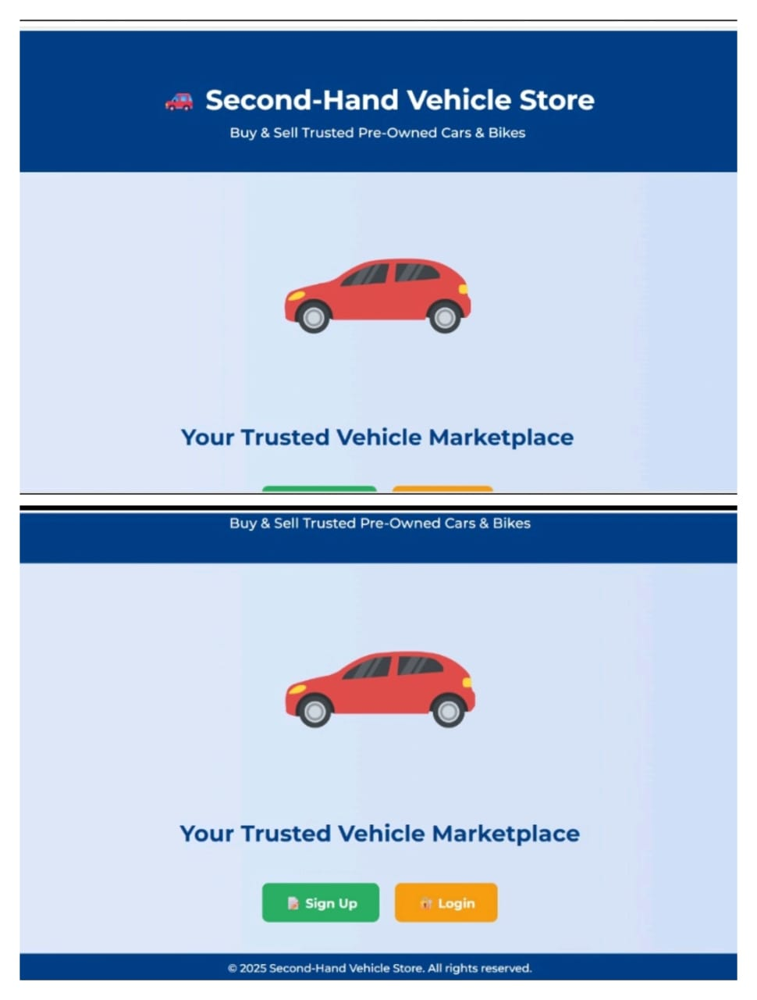

### ✍️ Sign Up Page
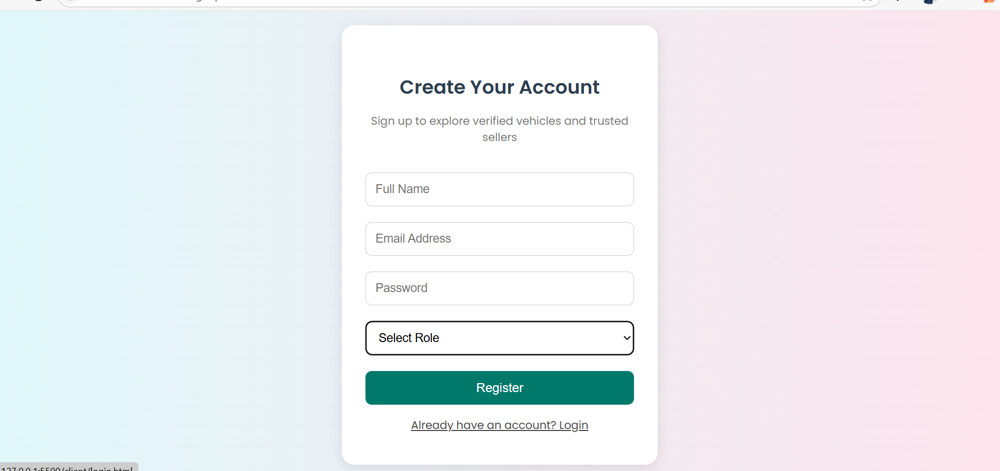

### 🔐 Login Page
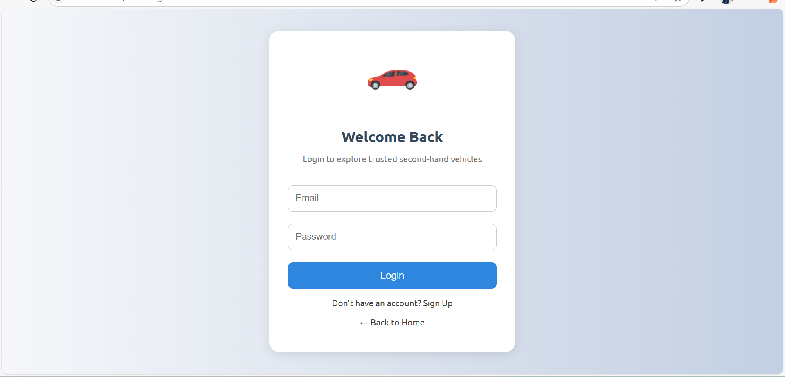

### 🛒 Dashboard with Listings
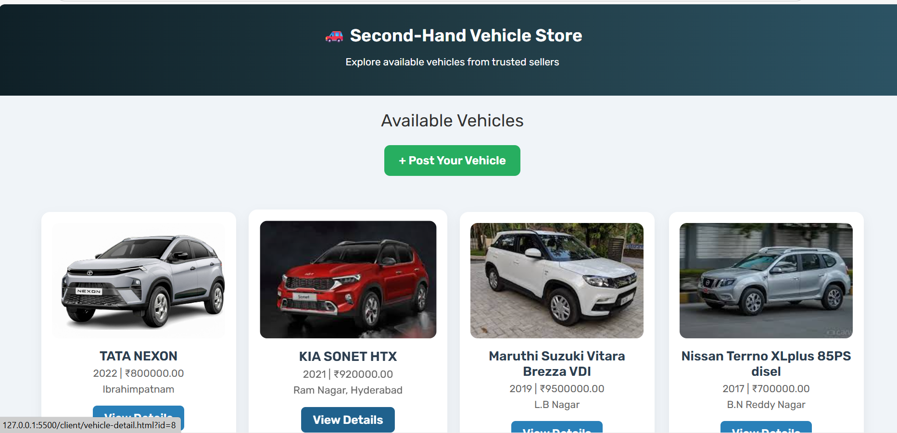
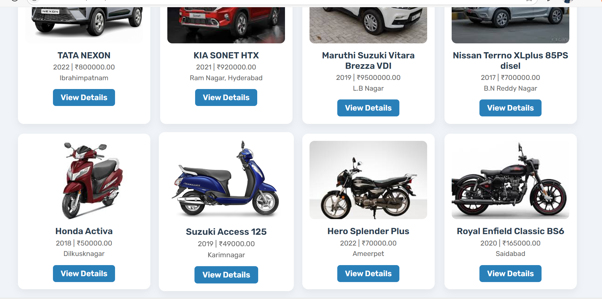
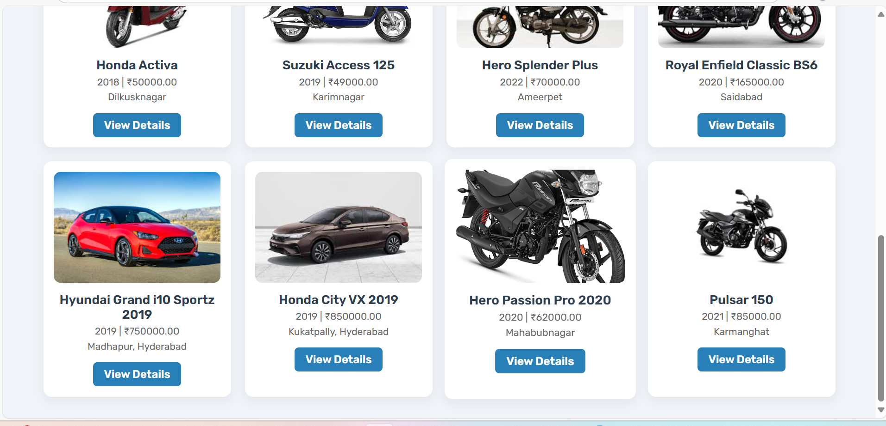

### 🚘 **Post a Vehicle**
  - Sellers can list vehicles with title, price, year, location, image, etc.
  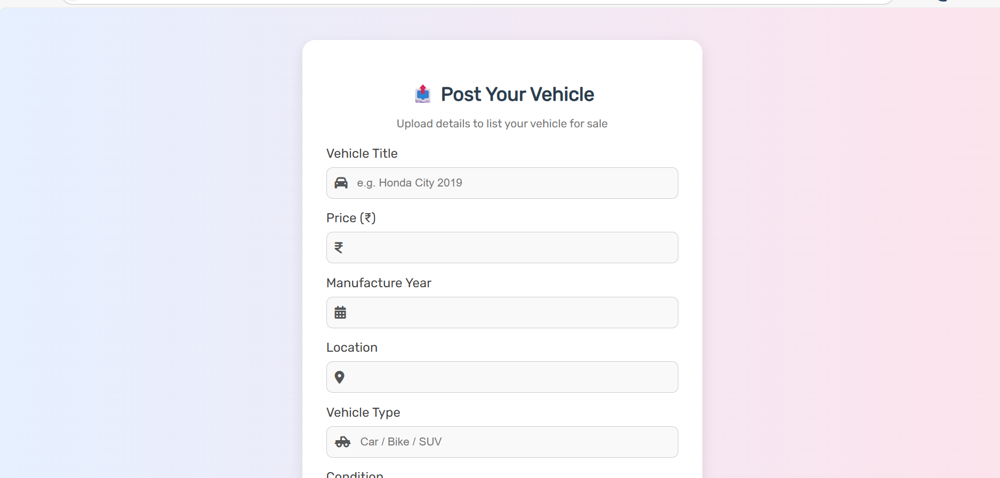
  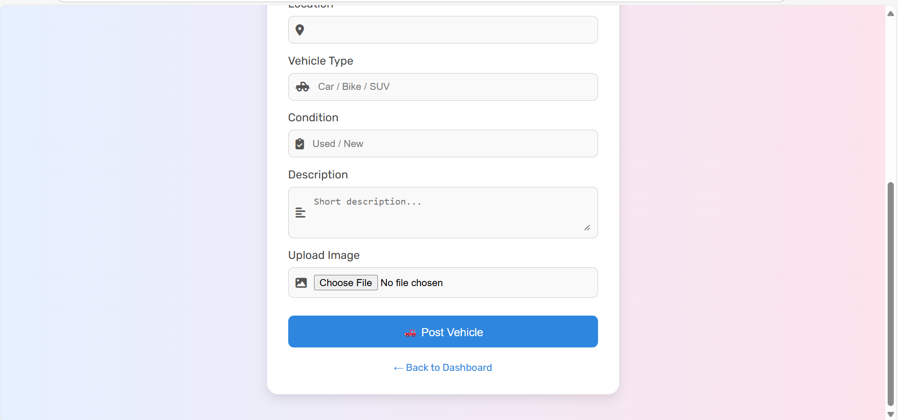

### 📄 Vehicle Detail with Contact Seller Form
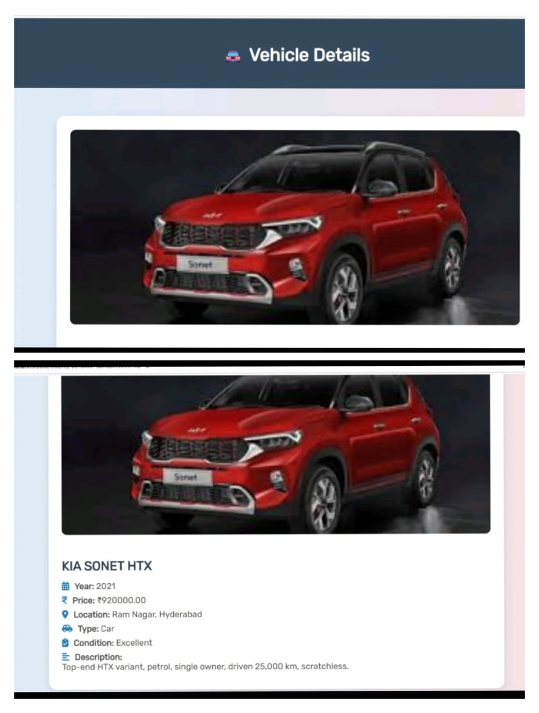
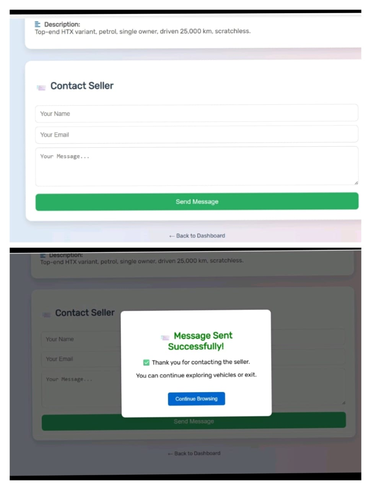

### 📨 **Seller dashboard**
    -Shows all vehicles posted by the seller with options to edit or delete each listing.
  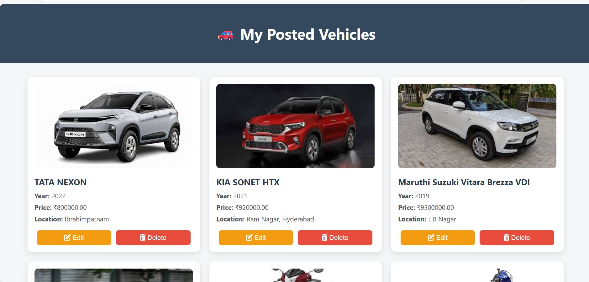
   
  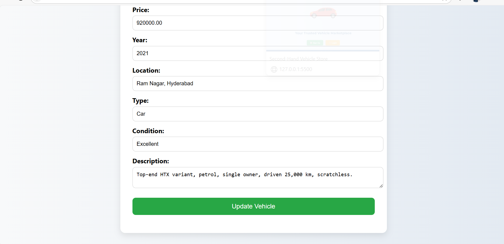
  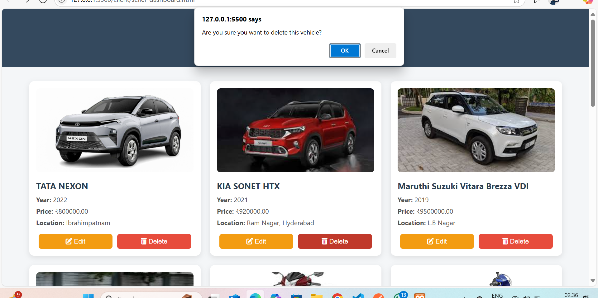   
  
### 🧑‍💼 Admin Panel
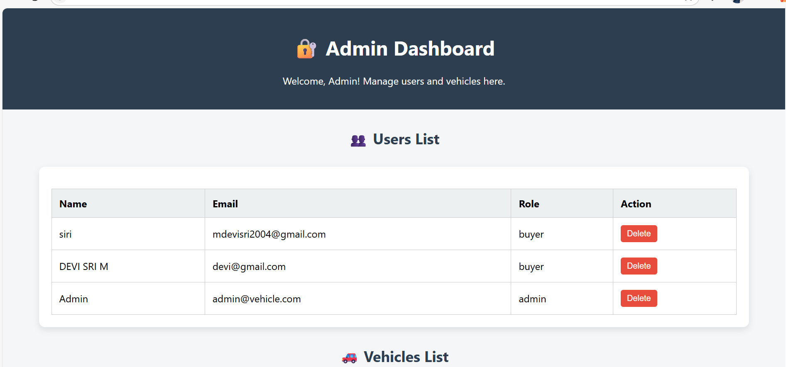
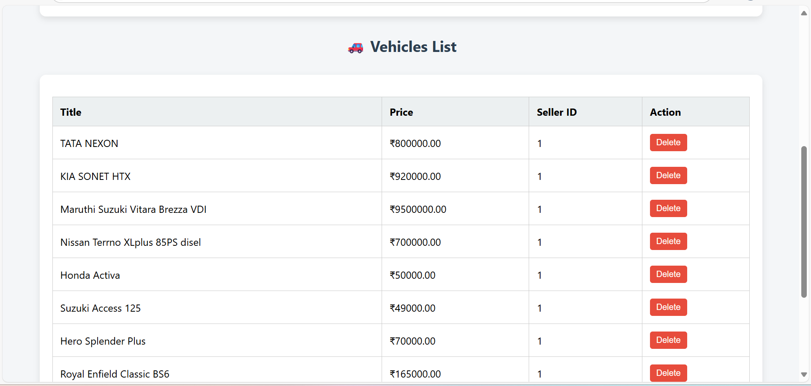

---

✅ Conclusion
This project demonstrates a complete second-hand vehicle e-commerce website with essential features like vehicle posting, browsing, seller contact, admin management, and role-based dashboards. It’s responsive and suitable for real-world scenarios.

💡 Future Enhancements
💳 Add payment gateway integration

🔍 Enable advanced search and filter options

🖼️ Add image gallery per vehicle

✅ Enable seller verification

📊 Add admin analytics panel

👩‍💻 Author
M. Devi Sri
🔗 GitHub Profile
(https://github.com/devisri4)
